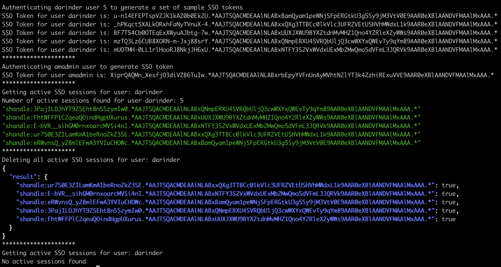

# ForgeRock AM Script to Disable a User and Delete all Active Tokens

To execute this script run:
./delete_tokens.sh [username] where username is the user you wish to disable and delete all their active tokens.
  
The output will be as follows:

./delete_tokens.sh darinder



To tailor for your own environment edit the environment variables at the top of the script:
```REALM=test
AM_HOST=http://openam.test.com:9499/openam
AM_AUTHENTICATE=$AM_HOST/json/realms/ROOT/authenticate
AM_USER_AUTHENTICATE=$AM_HOST/json/realms/$REALM/authenticate
CONTENT_HEADER='Content-Type: application/json'
AM_AUTHENTICATE_VERSION='Accept-API-Version: resource=2.0, protocol=1.0'
AM_SESSIONS_VERSION='Accept-API-Version: resource=3.1, protocol=1.0'
AM_USER_VERSION='Accept-API-Version: protocol=2.1,resource=3.0'
LOCK_ATTRIBUTE=inetUserStatus
ADMIN_USERNAME=amadmin
ADMIN_PASSWORD=password
TARGET_USERNAME=darinder
TARGET_PASSWORD=Ch4ng31t
TARGET_AUTHN_ITERATIONS='5'```
